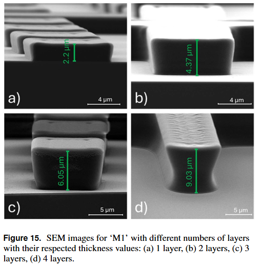
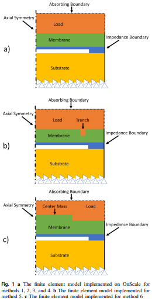

# Ahmad Elshenety

**Final-year Ph.D. Candidate in Materials Science and Nanotechnology**  
Bilkent University, Ankara, Turkey  
[Email](mailto:a.elshenety@bilkent.edu.tr) | [Google Scholar](https://scholar.google.com/citations?user=GX00gPAAAAAJ&hl=en) | [LinkedIn](https://www.linkedin.com/in/elshenety/) | [ORCID](https://orcid.org/0000-0002-5783-4669)

---

## About Me
I am a final-year Ph.D. candidate at Bilkent University, specializing in the design, microfabrication, and multiphysics modeling of advanced capacitive micromachined ultrasonic transducers. While conventional CMUTs typically require relatively high operating voltages, my research focuses on developing a low-voltage stiction-free **Capacitive Micromachined Ultrasonic Transducers with a Force Plate (CMUT-FP)**. By leveraging this design, my work has successfully achieved a **$>2.6\times$** sensitivity enhancement alongside a significantly **reduced operating voltage**. My core research focus is to deliver **low-voltage**, **high-sensitivity**, and **wide-band** CMUT-based transducers optimized for **wearable ultrasound**.

---
## Research & Technical Portfolio

* **Design & Innovation:** Developed a novel CMUT architecture (**CMUT-FP**) engineered for enhanced sensitivity and lower voltage requirements.
* **Simulation & Modeling:** Conducted extensive multiphysics simulations utilizing **ANSYS** and **OnScale**.
* **Cleanroom Fabrication:** Fabricated functional devices using advanced microfabrication techniques, including **ALD**, **ICP**, and **XeF₂** etching.
* **Characterization:** Validated device performance through precise electrical measurements and optical profilometry.

---

## Selected Publications
*During my PhD, I have authored 3 peer-reviewed articles in leading journals, including **IEEE Journal of Microelectromechanical Systems**, **Journal of Micromechanics and Microengineering**, and **Microsystem Technologies**.*

*   **High Thickness Material Lift-off Using Multi-layer Photoresist**  
    *Ahmad Elshenety, Merve Mintas Kucuk, Mehmet Yilmaz*  
    *Journal of Micromechanics and Microengineering*.
    [[DOI Link]](https://doi.org/10.1088/1361-6439/adac6b)  
    
    

*   **Enhancing output pressure of capacitive micromachined ultrasonic transducers (CMUTs): a comparative FEM study of different pressure-boosting methods**  
    *Ahmad Elshenety, Mehmet Yilmaz*  
    *Microsystem Technologies*.
    [[DOI Link]](https://doi.org/10.1007/s00542-025-05900-6)  
      

*   **Optical Characterization of Dynamic CMUTs Using Zygo Optical Profilometers: An Alternative to Laser Doppler Vibrometers**  
    *Ahmad Elshenety, Merve Mintas Kucuk, Mehmet Yilmaz*  
    *Journal of Microelectromechanical Systems*.  
    [[DOI Link]](https://doi.org/10.1109/JMEMS.2024.3524004)    
---

## Technical Skills
*   **Simulation Tools:** OnScale, ANSYS (static analysis and modal analysis), MATLAB
*   **Cleanroom Expertise:**
       *   **Microfabrication:** Mask Aligner, ICP Etching, ALD, E-beam Evaporator, Sputtering, Thermal Evaporator, PECVD, XeF2 Etching, Wet Etching.
       *  **Characterization:** SEM/EDX, Zygo Optical Profilometer (Dynamic/Static), Impedance Analyzer, Semiconductor Parameter Analyzer (SPA), Bruker Dektak, Keyence VKX Microscope, Probe Station, Dicing Saw, LPKF PCB Milling Machine.
*   **Languages:** English (Proficient), Arabic (Native)

---
*References available upon request*
